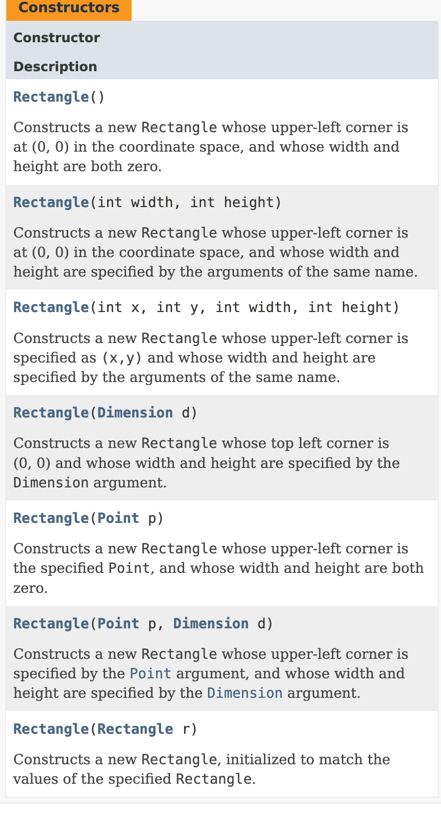
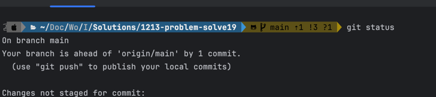

# Problem Solve 19 

## Part 1 

 - What package is `Rectangle in`?
   - the `java.awt` package 
 - How do you import and use Rectangle? 
   - `import java.awt.Rectangle;` which imports the `Rectangle`class or `import java.awt.*;` (to import the whole package)
   - `Rectangle r = new Rectangle(10, 20, 30, 40);` which creates a new `Rectangle` object with the specified coordinates and dimensions.
   - The [documentation](https://docs.oracle.com/en/java/javase/21/docs/api/java.desktop/java/awt/Rectangle.html) provides a complete list of methods and fields for the `Rectangle` class.
 - How many constructors does it have? 
   - 
   - The `Rectangle` class has **7** constructors.
 - Identify the error in: 
 > r = new Rectangle(); \
 > r.translate(10, "Hello");
- `translate` method takes two `int` parameters, but the second parameter is a `String`.
- The correct code should be `r.translate(10, 20);` where both parameters are integers.

## Part 2 

### Git status output

